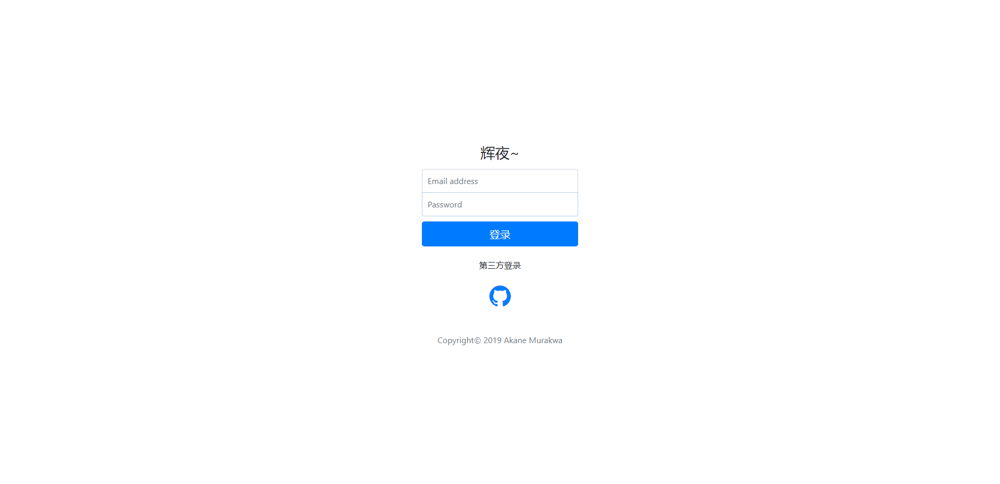

## kaguya

未启航的树形结构文档系统

### 功能
- 树型结构文档
- 第三方登录认证
- 退出系统
- 新增分类
- 新增文档

### 预览

### 未启航的纸飞机
某一天，还是把这个废弃的项目又捡了起来。但是这一次，我并不打算完整地实现它，它只是未启航的纸飞机，只是我一个小的设想。

用户的设计，支持账号/密码登录(Local OAuth)，支持第三方的登录验证(Third-part OAuth)。采用用户[ID+token]的方式进行验证，将`type:userId:过期时间:token(salt)`用户信息存储到cookie，session中存放用户基本信息，redis中存放用户所有信息。当用户重新访问的时候，从cookie中取出相关信息，验证过期时间。用户数据初始化采用SQL脚本的形式，如果你不想用本地用户登录，那么可以采用第三方登录验证的形式，只支持Github。

内容采用[分类+树形文档结构]的形式，这是我一直以来的一个念想。每一个内容我会划分一个类别，会有一个大的类别，然后又有很多小的类别，就好像树结构一样，有根节点，有子节点，这次故事能够接着上次的故事。阅读文章的时候，我更希望的是能够像阅读一本书一样。

### 工具库
- uuid：SnowFlake
- json转换：FastJson和GSON
- 编辑器：Editormd
- Markdown转换：flexmark
- 第三方授权登录：JustAuth

### 构建
#### 环境配置
* MySQL 5.7
* Redis 5
* JDK1.8

#### 配置
在`application.yml`文件中修改MySQL和Redis配置, 运行sql目录下的`kaguya.sql`或`kaguya-data-structure.sql`
 
#### 初始化
运行`com.github.kaguya.KaguyaApplicationTests.user`初始化用户
 
#### 访问
访问[http://localhost:9420](http://localhost:9420)
 
### License
[BSD 3-Clause](./LICENSE)